# E-commerce Django
Belajar membuat website e-commerce dengan menggunakan Django dan Python

### Home Page
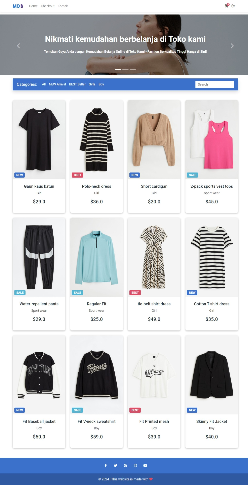

### New Arrival Page
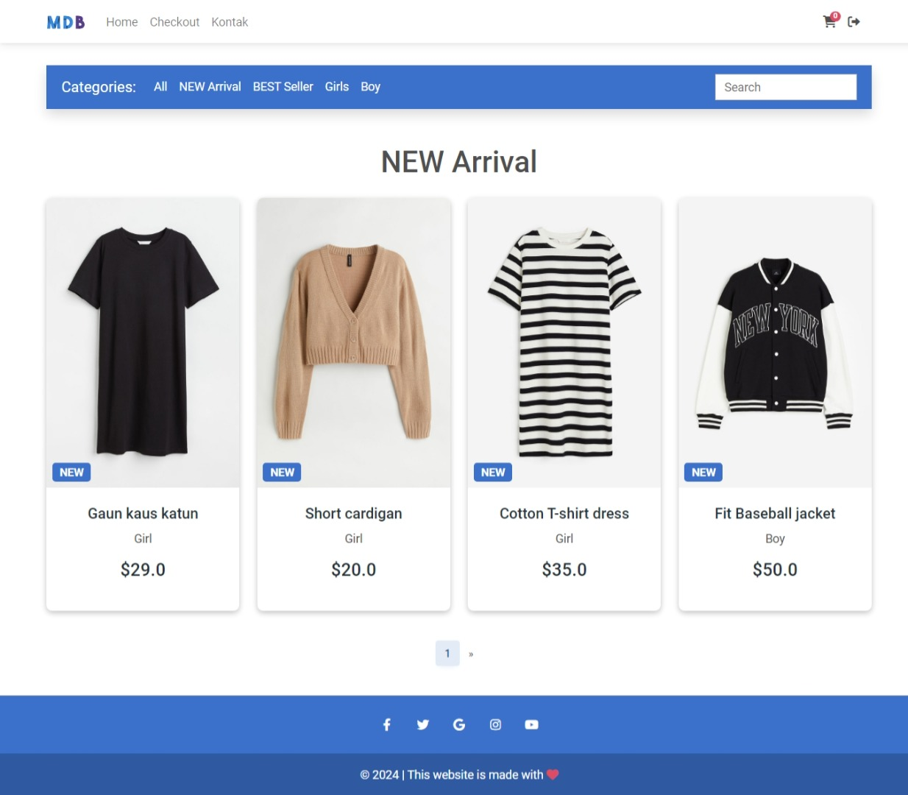

### Best Seller Page
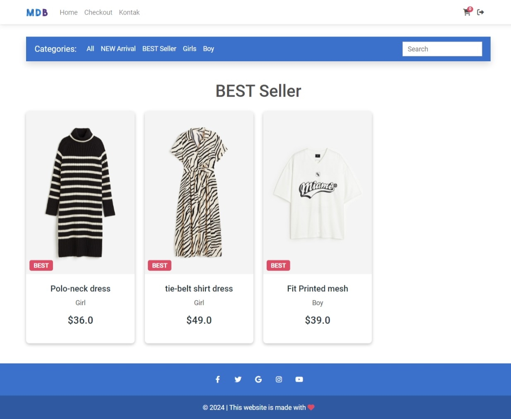

### For Girl Page
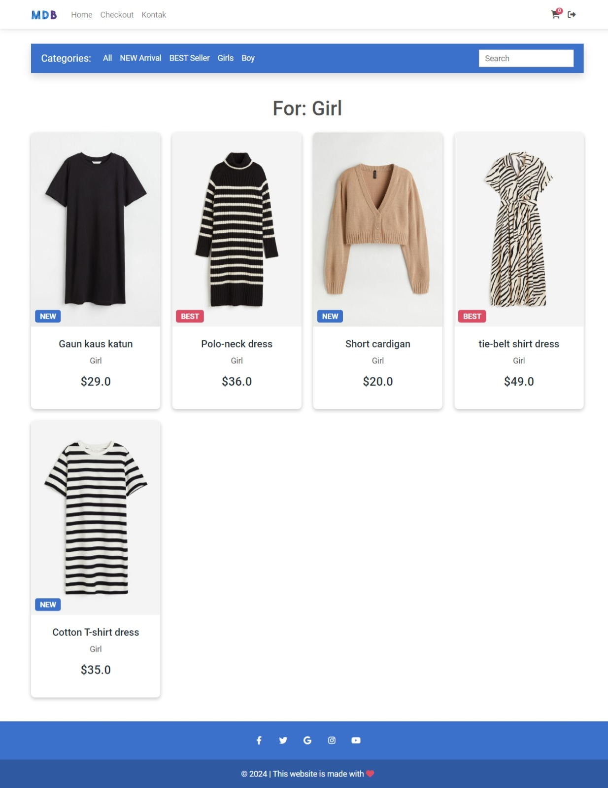

### For Boy Page
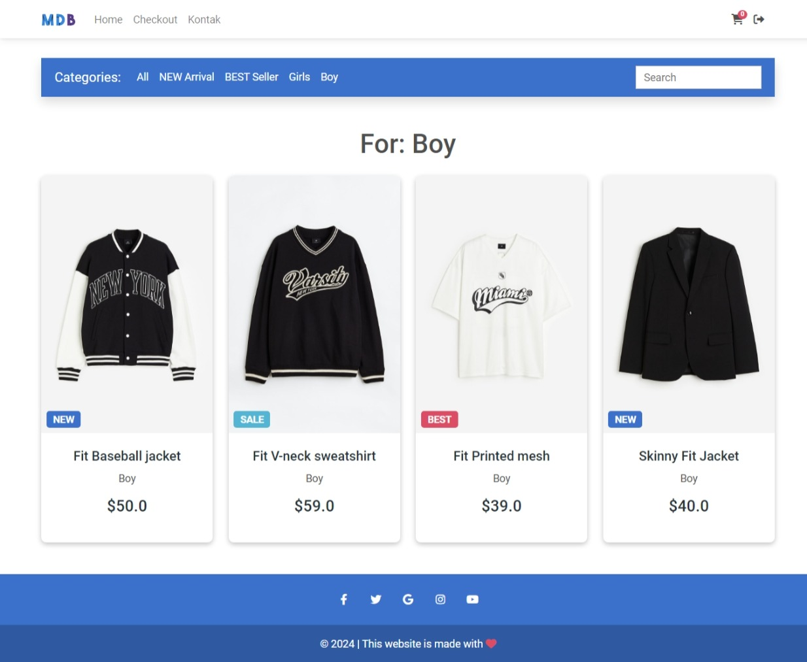

### Detail Page
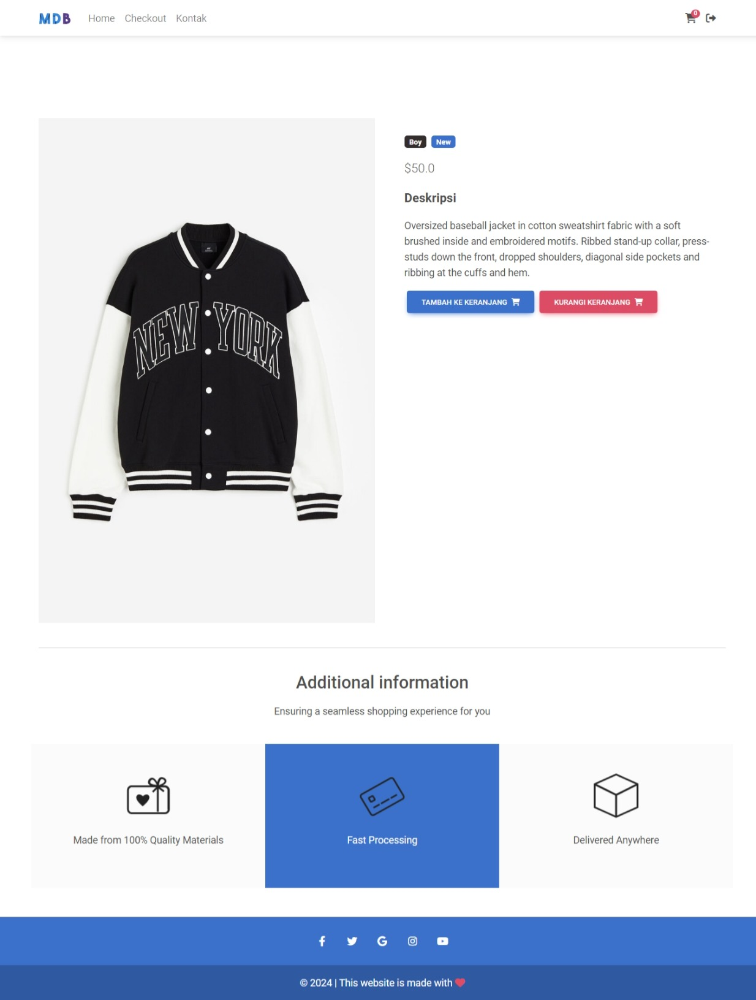

### Order Summary Page
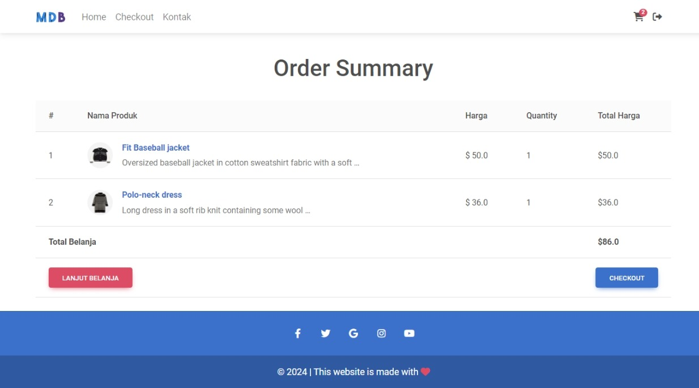

### Checkout Page
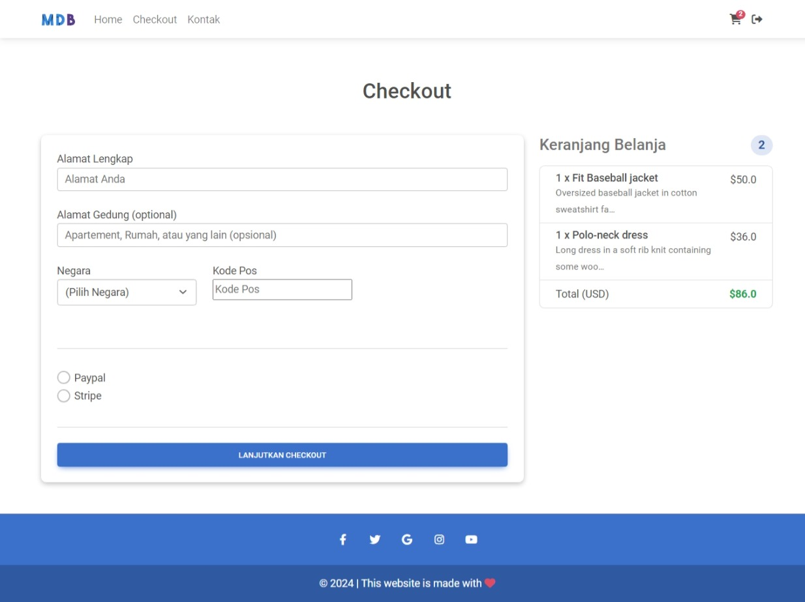

### Contact Page
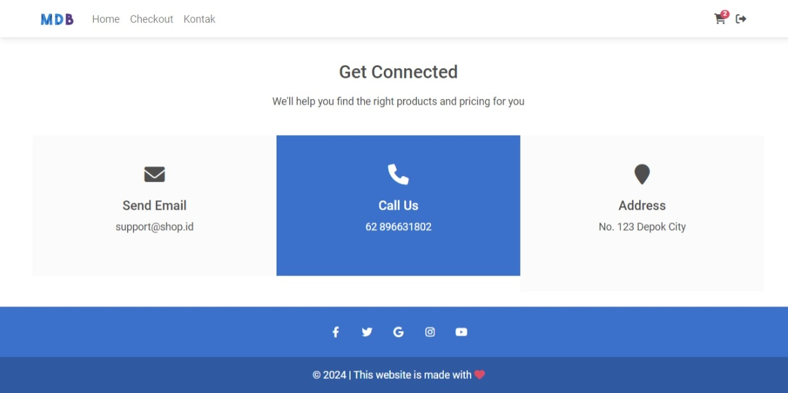

### Login Page
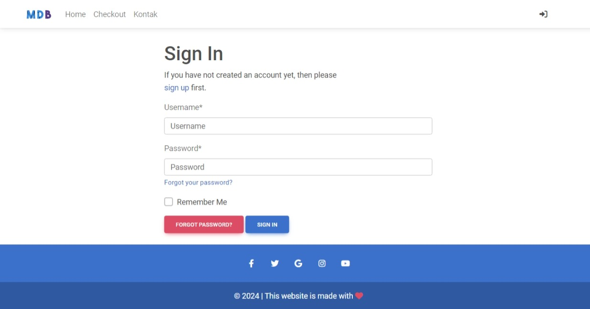

### Django Admin Page
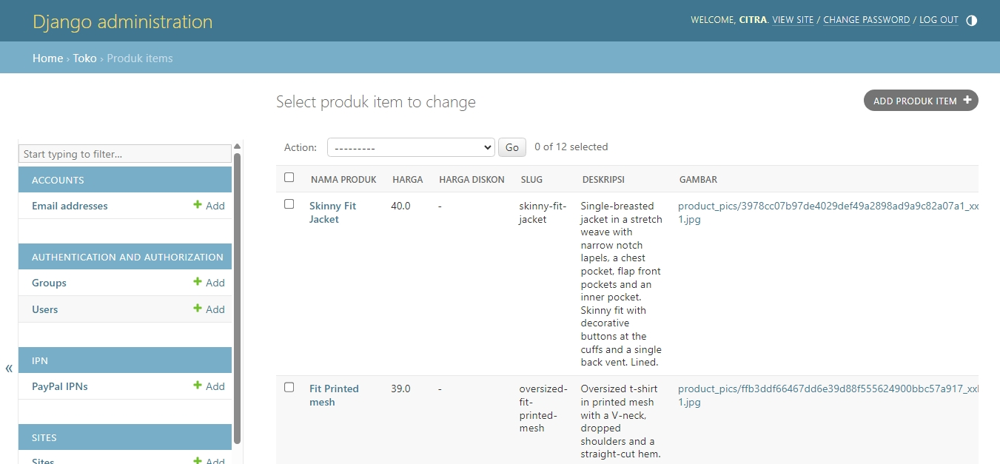
